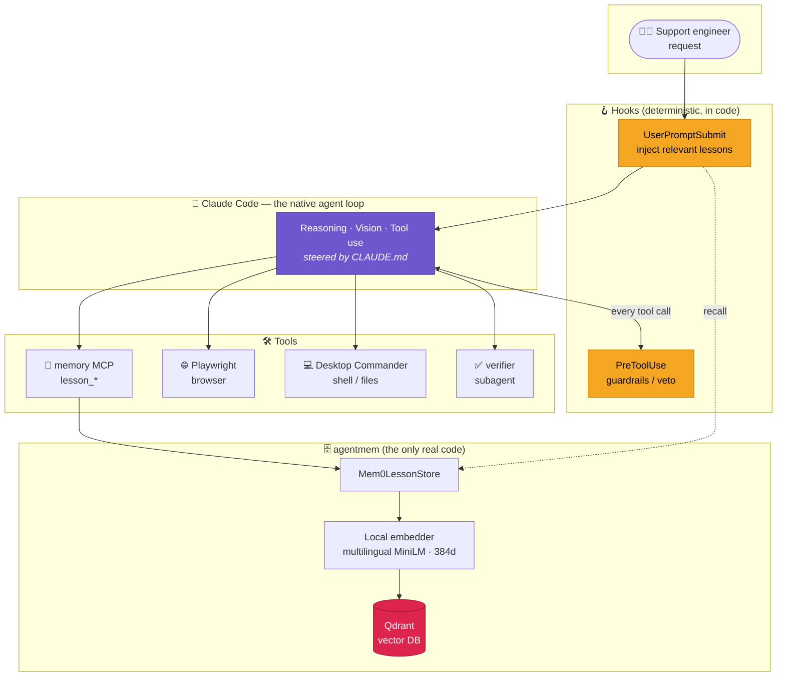
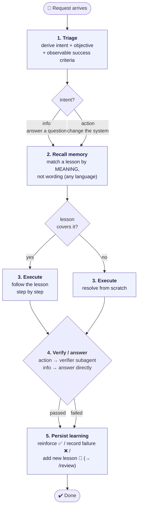
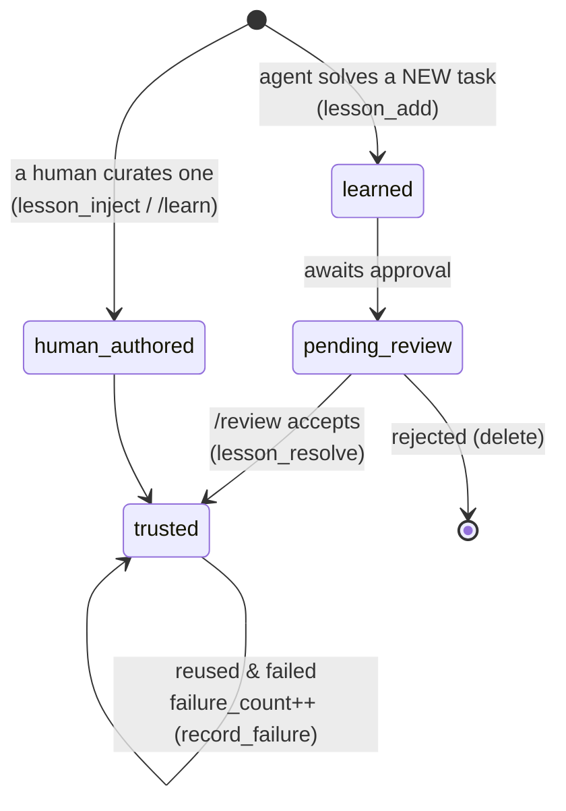
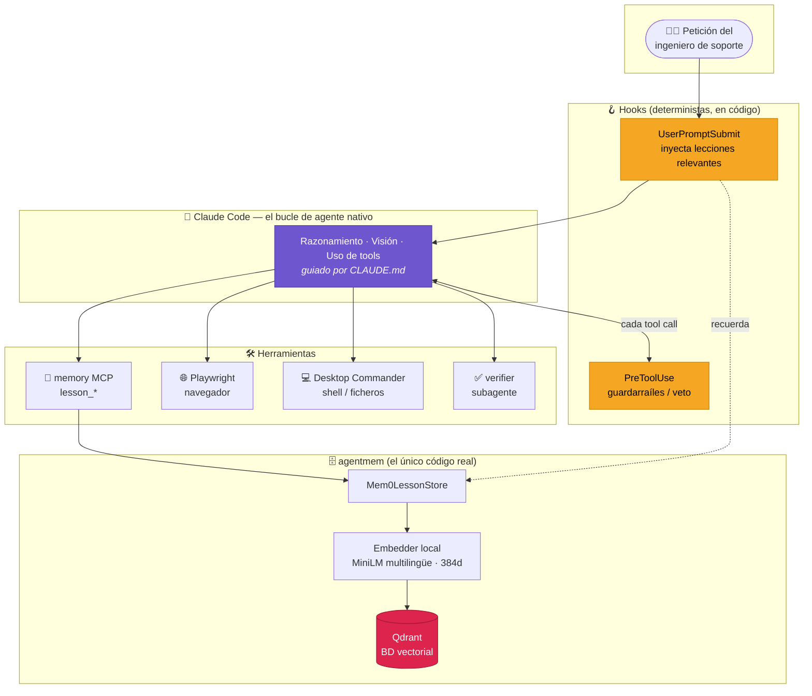
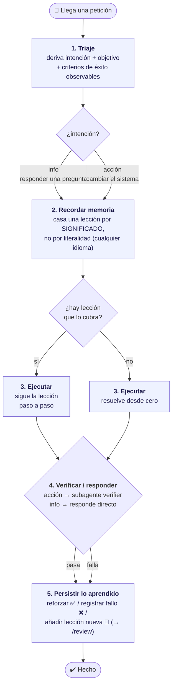
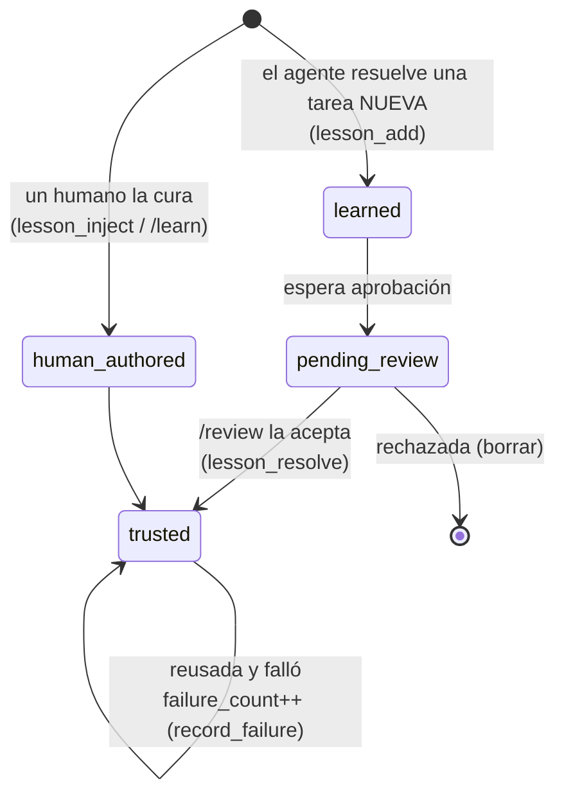
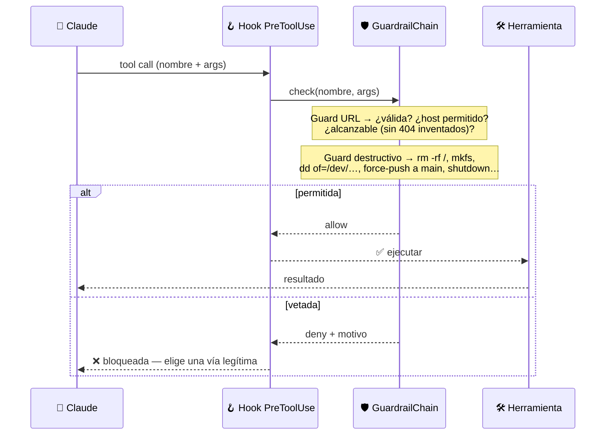

<div align="center">

# 🤖 Support Engineer

### A self-improving automation agent for enterprise support — built _on_ Claude Code, not just _with_ it.

**The loop, the reasoning and the vision are native. The only real code is a memory that lets the agent _learn_.**

[](https://claude.com/claude-code)
[](https://www.python.org/)
[](https://qdrant.tech/)
[](https://mem0.ai/)
[](https://modelcontextprotocol.io/)

[**English**](#-english) · [**Español**](#-español)

</div>

---

<a name="-english"></a>

## 🇬🇧 English

### What is this?

**Support Engineer is an automation agent for enterprise support tasks.** It runs on
**Claude Code**: the agent loop, the reasoning, and the vision (reading screenshots) are
all _native_ to the model — there is no orchestration framework to maintain.

The repository contributes **two things on top of Claude Code**:

| Piece | What it adds |
|-------|--------------|
| 🧠 **`agentmem`** — a lesson memory over Qdrant, exposed as the `memory` MCP server | The agent **remembers procedures** that worked and **reuses them by meaning**, so it gets better every time. |
| 🪝 **Two hooks** — auto-inject lessons + apply guardrails | Relevant memory is **fed in automatically**, and dangerous actions are **vetoed in code** before they run. |

> Everything else — the operating flow — is **instructions**, not code. They live in
> [`CLAUDE.md`](./CLAUDE.md) and steer the model directly. The "scalator" idea: the agent
> _scales its own competence_ by turning each solved task into reusable memory.

### The big picture



### How a request flows

Every request follows a five-step flow defined in `CLAUDE.md`:



- **`intent = info`** → the engineer wants an _answer_; nothing changes. Reply with the concrete facts.
- **`intent = action`** → the engineer wants the system _changed_; execute, then **prove it** with the `verifier` subagent before claiming success.
- When unsure, treat it as **action** (the conservative execute-and-verify path).

### The memory: how lessons live and grow

A **lesson** is a reusable, step-by-step procedure (`title` + `content`) plus two
counters the agent folds back. Search is **purely semantic** (dense-vector cosine
similarity in Qdrant) — a Spanish lesson matches an English task and vice-versa.



> 🔒 **Trust model:** lessons the agent invents start as `learned / pending_review` and
> surface in **`/review`** for a human to accept — they never silently become trusted
> guidance. Human-authored lessons are trusted immediately.

### Guardrails — policy enforced in code, not in prompts

A `PreToolUse` hook runs **before every tool call** and can veto it. This is the
anti-hallucination and anti-destruction backstop.


Both guards **fail open**: a bug or missing dependency never wedges the agent.

### Project layout

```
support-engineer/
├── CLAUDE.md                 # the operating flow (instructions = behaviour)
├── config.env                # all settings (KEY=VALUE) — single source of config
├── docker-compose.yml        # Qdrant on localhost:6333
├── .mcp.json                 # wires the `memory` MCP server
├── start_dashboard.sh        # launch the control panel + open the browser
├── hooks/
│   ├── inject_lessons.py     # UserPromptSubmit → auto-recall lessons
│   └── guardrail_check.py    # PreToolUse → veto bad URLs / destructive cmds
├── dashboard/                # the control panel (stdlib HTTP server + web UI)
│   ├── server.py             # thin HTTP coordinator: routing + dispatch
│   ├── envfile.py            # config.env read/write (atomic, comment-preserving)
│   ├── settings_store.py     # settings.json permissions allowlist (atomic)
│   ├── translation.py        # glob ↔ blocklist-regex helpers (pure)
│   └── assets/               # layered front-end (api, dom, views, app)
└── src/agentmem/             # ← the only real code
    ├── config.py             # config layer (config.env → env vars → defaults)
    ├── lesson.py             # Lesson entity + origin / counters
    ├── ports.py              # LessonStore Protocol (the store abstraction)
    ├── store.py              # Mem0LessonStore over Qdrant (semantic)
    ├── atomicio.py           # atomic text-file writes (temp file + rename)
    ├── guardrails.py         # URL + destructive-command guards
    ├── rules_store.py        # custom (user-defined) blocked-command rules
    └── mcp_server.py         # exposes lesson_* as MCP tools
```

### Quick start

```bash
docker compose up -d        # 1. start Qdrant (the lesson store) on :6333
pip install -e .            # 2. install agentmem (mem0 + qdrant-client + mcp + httpx)
# 3. open the repo in Claude Code — the `memory` MCP server + hooks load automatically
```

The embedder runs **locally, in-process** (sentence-transformers, multilingual MiniLM) —
no API key, fully offline after the one-time model download.

### Configuration

All settings live in [`config.env`](./config.env) (`KEY=VALUE`). Resolution order:

> **real environment variable** ⟶ **`config.env`** ⟶ **built-in defaults**

Point at another file with `AGENTMEM_CONFIG=/path/to/file`. To swap the local embedder
for a remote OpenAI-compatible one, set `EMBEDDER_PROVIDER=openai` +
`EMBEDDER_MODEL / BASE_URL / API_KEY / DIMS` (changing dimensions needs a fresh Qdrant
collection).

### Control panel

A visual control panel for a level-3 engineer to inspect and change everything the agent
exposes — no terminal needed. It is a dependency-free **stdlib HTTP server** + a layered
web UI (Tailwind); the embedder/Qdrant aside, it runs fully offline.

```bash
./start_dashboard.sh            # starts the server and opens http://localhost:8787
./start_dashboard.sh 9000       # custom port
# or, manually:
python dashboard/server.py --port 8787
```

> Qdrant must be up (`docker compose up -d`) for the **Lessons** tab; the rest works without it.

| Tab | What you control |
|-----|------------------|
| **Guardrails** | URL guard on/off, reachability probe, domain allowlist, probe timeout/UA; destructive-guard master switch; how each guard works. |
| **Commands** | The full blocklist (built-in + **custom rules you add**, each toggled on/off or deleted) and the allowlist — **move commands either way** (allowed ⇆ blocked). |
| **Lessons** | Live counts (total / pending / approved) and the pending-review queue with **Validate** / **Reject**. |
| **Memory** | Qdrant host/port/collection/namespace, embedder provider/model/dims, retrieval limits. |

Edits are written back to [`config.env`](./config.env), `.claude/settings.json`
(permissions only) and `custom_guardrails.json` (user rules) — and apply on the agent's
next tool call. New config keys: `GUARD_URL_ENABLED`, `GUARD_DESTRUCTIVE_ENABLED`,
`GUARD_DISABLED_PATTERNS`, `GUARD_CUSTOM_RULES_FILE`.

### Slash commands

| Command | Does |
|---------|------|
| `/review` | Triage the lessons the agent learned that await human approval. |
| `/learn <procedure>` | Manually capture a procedure into memory. |

---

<a name="-español"></a>

## 🇪🇸 Español

### ¿Qué es esto?

**Support Engineer es un agente de automatización para tareas de soporte
empresarial.** Funciona sobre **Claude Code**: el bucle del agente, el razonamiento y la
visión (leer capturas) son _nativos_ del modelo — no hay framework de orquestación que
mantener.

El repositorio aporta **dos cosas encima de Claude Code**:

| Pieza | Qué añade |
|-------|-----------|
| 🧠 **`agentmem`** — una memoria de lecciones sobre Qdrant, expuesta como el servidor MCP `memory` | El agente **recuerda procedimientos** que funcionaron y los **reutiliza por significado**, así que mejora cada vez. |
| 🪝 **Dos hooks** — auto-inyectar lecciones + aplicar guardarraíles | La memoria relevante se **inyecta automáticamente**, y las acciones peligrosas se **vetan en código** antes de ejecutarse. |

> Todo lo demás — el flujo operativo — son **instrucciones**, no código. Viven en
> [`CLAUDE.md`](./CLAUDE.md) y guían al modelo directamente. La idea "scalator": el agente
> _escala su propia competencia_ convirtiendo cada tarea resuelta en memoria reutilizable.

### La visión de conjunto



### Cómo fluye una petición

Cada petición sigue un flujo de cinco pasos definido en `CLAUDE.md`:



- **`intención = info`** → el ingeniero quiere una _respuesta_; nada cambia. Responde con los datos concretos.
- **`intención = acción`** → quiere _cambiar_ el sistema; ejecuta y luego **demuéstralo** con el subagente `verifier` antes de declarar éxito.
- En caso de duda, trátalo como **acción** (la vía conservadora: ejecutar y verificar).

### La memoria: cómo viven y crecen las lecciones

Una **lección** es un procedimiento reutilizable, paso a paso (`title` + `content`), más
dos contadores que el agente realimenta. La búsqueda es **puramente semántica**
(similitud de coseno sobre vectores densos en Qdrant) — una lección en español casa con
una tarea en inglés y viceversa.



> 🔒 **Modelo de confianza:** las lecciones que el agente inventa empiezan como
> `learned / pending_review` y aparecen en **`/review`** para que un humano las acepte —
> nunca se convierten en guía de confianza en silencio. Las creadas por humanos son de
> confianza al instante.

### Guardarraíles — política aplicada en código, no en prompts

Un hook `PreToolUse` se ejecuta **antes de cada llamada a herramienta** y puede vetarla.
Es la red de seguridad anti-alucinación y anti-destrucción.



Ambos guards **fallan en abierto** (_fail-open_): un bug o una dependencia ausente nunca
bloquean al agente.

### Estructura del proyecto

```
support-engineer/
├── CLAUDE.md                 # el flujo operativo (instrucciones = comportamiento)
├── config.env                # todos los ajustes (KEY=VALUE) — fuente única de config
├── docker-compose.yml        # Qdrant en localhost:6333
├── .mcp.json                 # cablea el servidor MCP `memory`
├── start_dashboard.sh        # arranca el panel de control + abre el navegador
├── hooks/
│   ├── inject_lessons.py     # UserPromptSubmit → auto-recuerda lecciones
│   └── guardrail_check.py    # PreToolUse → veta URLs malas / comandos destructivos
├── dashboard/                # el panel de control (servidor HTTP stdlib + UI web)
│   ├── server.py             # coordinador HTTP fino: enrutado + dispatch
│   ├── envfile.py            # lectura/escritura de config.env (atómica, conserva comentarios)
│   ├── settings_store.py     # allowlist de permisos en settings.json (atómica)
│   ├── translation.py        # helpers glob ↔ regex de bloqueo (puros)
│   └── assets/               # front-end por capas (api, dom, views, app)
└── src/agentmem/             # ← el único código real
    ├── config.py             # capa de config (config.env → env vars → defaults)
    ├── lesson.py             # entidad Lesson + origen / contadores
    ├── ports.py              # Protocol LessonStore (la abstracción del almacén)
    ├── store.py              # Mem0LessonStore sobre Qdrant (semántico)
    ├── atomicio.py           # escrituras atómicas de ficheros (temp + rename)
    ├── guardrails.py         # guards de URL + comandos destructivos
    ├── rules_store.py        # reglas de comandos bloqueados definidas por el usuario
    └── mcp_server.py         # expone lesson_* como tools MCP
```

### Arranque rápido

```bash
docker compose up -d        # 1. arranca Qdrant (la memoria) en :6333
pip install -e .            # 2. instala agentmem (mem0 + qdrant-client + mcp + httpx)
# 3. abre el repo en Claude Code — el servidor MCP `memory` + los hooks cargan solos
```

El embedder corre **localmente, en el proceso** (sentence-transformers, MiniLM
multilingüe) — sin API key, totalmente offline tras la descarga única del modelo.

### Configuración

Todos los ajustes viven en [`config.env`](./config.env) (`KEY=VALUE`). Orden de
resolución:

> **variable de entorno real** ⟶ **`config.env`** ⟶ **defaults del código**

Apunta a otro fichero con `AGENTMEM_CONFIG=/ruta/al/fichero`. Para cambiar el embedder
local por uno remoto compatible con OpenAI, define `EMBEDDER_PROVIDER=openai` +
`EMBEDDER_MODEL / BASE_URL / API_KEY / DIMS` (cambiar la dimensión exige una colección
Qdrant nueva).

### Panel de control

Un panel visual para que un ingeniero de nivel 3 inspeccione y cambie todo lo que el
agente expone — sin tocar la terminal. Es un **servidor HTTP de la stdlib** (sin
dependencias) + una UI web por capas (Tailwind); salvo el embedder/Qdrant, funciona 100%
offline.

```bash
./start_dashboard.sh            # arranca el servidor y abre http://localhost:8787
./start_dashboard.sh 9000       # puerto a medida
# o, manualmente:
python dashboard/server.py --port 8787
```

> Qdrant debe estar arriba (`docker compose up -d`) para la pestaña **Lecciones**; el resto funciona sin él.

| Pestaña | Qué controlas |
|---------|---------------|
| **Guardrails** | Guard de URL on/off, probe de accesibilidad, allowlist de dominios, timeout/UA; interruptor maestro del guard destructivo; cómo funciona cada guard. |
| **Comandos** | La blocklist completa (built-in + **reglas custom que añades**, cada una activable o eliminable) y la allowlist — **mueve comandos en ambos sentidos** (permitido ⇆ bloqueado). |
| **Lecciones** | Conteos en vivo (total / por revisar / aprobadas) y la cola pendiente con **Validar** / **Rechazar**. |
| **Memoria** | Host/puerto/colección/namespace de Qdrant, provider/modelo/dims del embedder, límites de recuperación. |

Los cambios se escriben en [`config.env`](./config.env), `.claude/settings.json` (solo
permisos) y `custom_guardrails.json` (reglas de usuario) — y aplican en la siguiente
llamada del agente. Nuevas claves de config: `GUARD_URL_ENABLED`,
`GUARD_DESTRUCTIVE_ENABLED`, `GUARD_DISABLED_PATTERNS`, `GUARD_CUSTOM_RULES_FILE`.

### Comandos slash

| Comando | Hace |
|---------|------|
| `/review` | Tría las lecciones que el agente aprendió y esperan aprobación humana. |
| `/learn <procedimiento>` | Captura manualmente un procedimiento en memoria. |

---

<div align="center">

**Built on 🤖 [Claude Code](https://claude.com/claude-code) · Powered by 🧠 [mem0](https://mem0.ai/) + [Qdrant](https://qdrant.tech/)**

</div>
